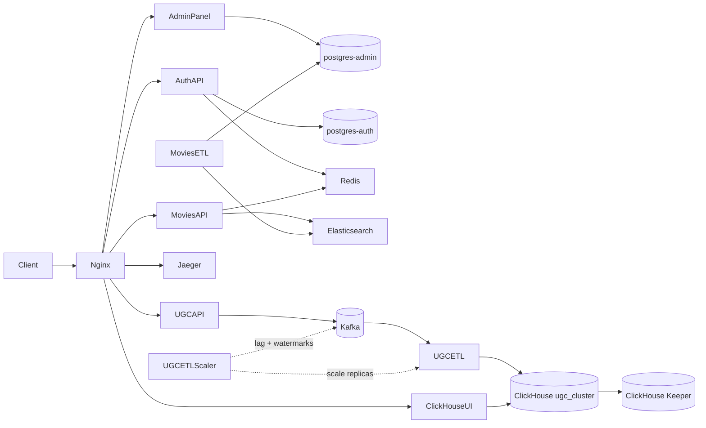

# Online Movie Theater — Integration Project

The repository wires together application services into a single platform: content management, catalog API, authentication, catalog ETL, UGC event ingestion, and UGC analytics ETL with lag-based autoscaling. Nginx acts as the public entry point in production mode; Jaeger collects distributed traces from the auth service.
The services are based on assignments from the Middle Python Developer course at [Yandex Practicum](https://practicum.yandex.ru/).

**Author:** [Artyom Suhov](https://github.com/rock4ts)

## Architecture



| Service | Role |
|---------|------|
| **admin_panel** | Django CMS — films, genres, people; staff admin with external JWT login |
| **auth_api** | FastAPI identity service — users, roles, RS256 JWT, Yandex ID OAuth |
| **movies_api** | FastAPI read API — catalog from Elasticsearch with Redis cache |
| **movies_etl** | Syncs catalog data from PostgreSQL to Elasticsearch indexes |
| **ugc_api** | Flask event ingestion — validates user activity events and publishes them to Kafka |
| **ugc_etl** | Scalable Kafka consumer — batches UGC events into ClickHouse |
| **ugc_etl_scaler** | Production-only cron-triggered scaler — adjusts `ugc-etl` replicas from Kafka lag and ingress rate |
| **nginx** | Reverse proxy, rate limiting, static files *(production mode only)* |
| **jaeger-tracer** | OpenTelemetry trace storage and UI |
| **postgres-admin** / **postgres-auth** | Separate databases for content and auth |
| **redis** | Rate limiting (auth) and response cache (movies) |
| **elastic-db** | Search indexes: `movies`, `genres`, `persons` |
| **kafka** | Event bus for UGC analytics — topics `ugc-events` and `ugc-anonymous-events` |
| **clickhouse** | Replicated and sharded analytical storage for five UGC event types |
| **clickhouse-keeper** | Coordinates ClickHouse replication and distributed DDL |
| **clickhouse-ui** | Browser UI for inspecting and querying the ClickHouse cluster |
| **clickhouse_profiler** | Standalone clustered ClickHouse benchmark with committed example results |

Each application lives in a Git submodule. See [`.gitmodules`](.gitmodules) for source repositories.

## Prerequisites

- Docker and Docker Compose v2
- [just](https://github.com/casey/just) *(optional, for local dev recipes)*
- [uv](https://docs.astral.sh/uv/) *(optional, for running services outside Docker)*

## Initial setup

1. Clone with submodules:

   ```bash
   git clone --recurse-submodules git@github.com:rock4ts/movies_portfolio.git
   cd movies_portfolio
   ```

   If already cloned without submodules:

   ```bash
   git submodule update --init --recursive
   ```

2. Generate JWT keys (required by auth, admin panel, movies API, and UGC API):

   ```bash
   mkdir -p auth-certs
   openssl genrsa -out auth-certs/jwt-private.pem 2048
   openssl rsa -in auth-certs/jwt-private.pem -pubout -out auth-certs/jwt-public.pem
   ```

3. Docker Compose reads environment from `env-files/`. These files are committed with development defaults; adjust credentials or OAuth settings there if needed.

4. Load initial catalog data into the admin database on first run (see [admin_panel/README.md](admin_panel/README.md)).

## Run modes

The project ships two main Compose files. They run the same application services but use different ClickHouse cluster sizes and networking.

### Production — `docker-compose.yml`

Use this mode to run the **full integrated stack** behind a single HTTP entry point, as it would behave in deployment.

```bash
docker compose up --build -d
docker compose down          # stop and remove containers
```

**Characteristics:**

- **nginx** listens on port **80** and routes all traffic
- Application containers are **not** exposed to the host directly
- Rate limiting on `/movies/api/` — 3 requests/s per IP, burst of 5 (`limit_req zone=one`); on `/ugc/api/` — 5 requests/s per IP, burst of 5 (`limit_req zone=two`)
- Jaeger UI is served under `/tracer/` (via `QUERY_BASE_PATH`)
- Static admin assets are served from `/static/`
- ClickHouse runs as two shards with two replicas per shard, coordinated by three Keeper nodes
- ClickHouse server ports remain internal; nginx exposes ClickHouse UI under `/ch-ui/`
- `ugc-etl-scaler` stays running so host cron can trigger scaling decisions with `docker compose exec`

| URL | Service |
|-----|---------|
| http://127.0.0.1/admin/ | Django admin panel |
| http://127.0.0.1/admin/api/v1/ | Admin read-only API |
| http://127.0.0.1/admin/docs/ | Admin OpenAPI (Swagger UI) |
| http://127.0.0.1/auth/api/ | Auth API |
| http://127.0.0.1/auth/api/docs | Auth OpenAPI (Swagger UI) |
| http://127.0.0.1/movies/api/ | Movies API |
| http://127.0.0.1/movies/api/docs | Movies OpenAPI (Swagger UI) |
| http://127.0.0.1/ugc/api/v1/events | UGC API — ingest authenticated user events |
| http://127.0.0.1/ugc/api/v1/anonymous-events | UGC API — ingest anonymous user events |
| http://127.0.0.1/ugc/api/docs/swagger | UGC OpenAPI (Swagger UI) |
| http://127.0.0.1/tracer/ | Jaeger UI |
| http://127.0.0.1/architecture/pre-ugc/ | Architecture docs (current stage) |
| http://127.0.0.1/ch-ui/ | ClickHouse UI |

### Development — `docker-compose.dev.yml`

Use this mode for **local debugging** — each service is reachable on its own port without nginx.

```bash
just dev                     # docker compose -f docker-compose.dev.yml up --build -d
just dev-down                # stop development stack
```

Or directly:

```bash
docker compose -f docker-compose.dev.yml up --build -d
docker compose -f docker-compose.dev.yml down
```

**Characteristics:**

- **No nginx** — call services directly by port
- Database, cache, and observability tools are exposed for local tools (psql, Redis CLI, etc.)
- Jaeger UI on the default port (no `/tracer/` prefix)
- ClickHouse runs as one shard with two replicas and one Keeper node

| URL | Service |
|-----|---------|
| http://127.0.0.1:8000/admin/ | Django admin panel |
| http://127.0.0.1:8080 | Admin OpenAPI (Swagger UI) |
| http://127.0.0.1:8002/docs | Auth API OpenAPI |
| http://127.0.0.1:8001/docs | Movies API OpenAPI |
| http://127.0.0.1:8003/openapi/swagger | UGC API OpenAPI |
| http://127.0.0.1:16686 | Jaeger UI |
| http://127.0.0.1:8081 | Kafka UI |
| http://127.0.0.1:3488 | ClickHouse UI |
| localhost:5432 | postgres-admin |
| localhost:5433 | postgres-auth |
| localhost:6379 | Redis |
| localhost:9200 | Elasticsearch |
| localhost:29092 | Kafka (host listener) |
| localhost:8123 / localhost:9000 | ClickHouse node 1 — HTTP / native TCP |
| localhost:8124 / localhost:9001 | ClickHouse node 2 — HTTP / native TCP |

## Architecture documentation

The repository keeps a **versioned record of how the system evolves** — not just the current state, but snapshots of the architecture at each major development stage.

Each stage is a self-contained folder with PlantUML diagrams and a short README. When a new service or capability is added (for example, a UGC module), a new stage folder is created to document the updated architecture while earlier stages remain available for comparison. Shared HTML templates at the root of `architecture-raw/` are copied into every stage during render; `readme.html` loads the stage `README.md` in the browser and renders it as HTML.

```
architecture-raw/              ← manually maintained sources (committed)
├── index.html                 ← shared stage index (copied into each stage on render)
├── readme.html                ← shared Markdown viewer (fetches README.md in-browser)
├── pre-ugc/
│   ├── components.puml
│   └── README.md
└── ugc/                       ← future stage
    └── …

architecture-rendered/         ← generated output (gitignored, not committed)
├── pre-ugc/
│   ├── components.svg
│   ├── README.md
│   ├── index.html             ← installed from shared template
│   └── readme.html            ← installed from shared template
└── …
```

**What goes where:**

| Directory | Purpose |
|-----------|---------|
| `architecture-raw/` | Source files edited by hand — `.puml` diagrams, per-stage `README.md`, and shared root `index.html` / `readme.html` |
| `architecture-rendered/` | Auto-generated SVGs, copied READMEs, and shared HTML installed per stage — listed in `.gitignore`, not committed |

**How to generate rendered docs locally:**

```bash
docker compose -f docker-compose.dev.yml run --rm architecture-renderer
```

This runs the `architecture-renderer` container once, reads from `architecture-raw/`, and writes the result to `architecture-rendered/`. Re-run after editing any source file in `architecture-raw/`.

**How rendering works:**

The `architecture-renderer` container runs `scripts/render_project_schemas.sh`. It recursively scans `architecture-raw/` for `.puml` files, renders each to SVG, copies non-diagram files (except the shared HTML templates) into the output, and installs `index.html` and `readme.html` into each stage directory.

| Mode | Input | Output | Access |
|------|-------|--------|--------|
| Production | `./architecture-raw` | `schema_output` volume | http://127.0.0.1/architecture/pre-ugc/ |
| Development | `./architecture-raw` | `./architecture-rendered` | Open files on disk after running the command above |

The current stage is **pre-ugc** — the integrated platform before user-generated content is added. See [architecture-raw/pre-ugc/README.md](architecture-raw/pre-ugc/README.md) for the full description.

## Implemented features

Subsections follow implementation order: catalog CMS and read path first, then identity and edge integration, then the UGC analytics stack.

### Admin panel

[`admin_panel/`](admin_panel/) is the **source of truth** for movie metadata — titles, descriptions, ratings, genres, and cast/crew. Staff manage the catalog in Django Admin; a small read-only REST API serves film JSON to other consumers.

| Surface | Role |
|---------|------|
| `/admin/` | Staff CMS for films/TV, genres, and people (actors, directors, writers) |
| `GET /admin/api/v1/movies/` | Paginated film list with genres and cast/crew |
| `GET /admin/api/v1/movies/<uuid>` | Single film by ID |

Admin login delegates credential checks to `auth_api`. On success the panel verifies the RS256 JWT with the shared public key and provisions a local `User` (email + staff flag). Only tokens with `is_superuser: true` are accepted. A break-glass local account remains available when auth is down. Successful logins are append-only audited in `AdminLoginLog`.

Catalog seed data lives in `database_dump.sql` (load via `LOAD_DATABASE_DUMP=true` in Docker, or manually). Details: [admin_panel/README.md](admin_panel/README.md).

### Movies ETL

[`movies_etl/`](movies_etl/) continuously synchronizes catalog changes from `postgres-admin` into Elasticsearch indexes `movies`, `genres`, and `persons`. Parallel pipelines cover filmwork (direct and by person/genre), genres, and persons. Progress between cycles is stored in a file watermark (`STATE_FILE_PATH`).

`PRODUCER_LIMIT` / `GENRE_PRODUCER_LIMIT` cap how many changed rows each pipeline reads per cycle; `*_SLEEP` variables pause between cycles (set to `0` for local development). Run once with `python -m app.main`. Details: [movies_etl/README.md](movies_etl/README.md).

### Movies API

[`movies_api/`](movies_api/) is the **read-optimized catalog API**. It queries Elasticsearch indexes populated by movies ETL and caches responses in Redis.

| Method | Path | Description |
|--------|------|-------------|
| `GET` | `/movies/api/v1/films/` | Paginated list with optional genre filter and rating sort |
| `GET` | `/movies/api/v1/films/search` | Full-text search by title |
| `GET` | `/movies/api/v1/films/<uuid>` | Film detail (access-controlled) |
| `GET` | `/movies/api/v1/genres/` | Genre list |
| `GET` | `/movies/api/v1/persons/search` | Person search |
| `GET` | `/movies/api/v1/persons/<uuid>/films` | Films linked to a person |

Film detail checks each film's `access_label` (`free` / `premium` / `vip`) against the caller's JWT `access_labels`. Anonymous callers see `free` only; `is_superuser=true` is unrestricted. Tokens are verified offline with the auth public key. Details: [movies_api/README.md](movies_api/README.md).

### Auth API

[`auth_api/`](auth_api/) is the **identity and access layer**. It registers users, issues RS256 access tokens and refresh cookies, manages roles with `access_labels` (`free` / `premium` / `vip`), and records partitioned login history.

| Area | Endpoints |
|------|-----------|
| Auth | `POST /auth/api/token`, `/refresh`, `/logout`, `/logout-others` |
| Users | `POST /auth/api/users`, `GET /users/me`, email/password change, login history |
| Roles | CRUD and assign/revoke (superuser only) |
| Yandex ID | `GET /auth/api/yandexid/login`, `GET /auth/api/yandexid/token` |

Refresh tokens are blocked via Redis; sensitive routes are rate-limited per client IP. The service exports OpenTelemetry spans to Jaeger. Downstream services (`admin_panel`, `movies_api`, `ugc_api`) verify JWTs locally with the mounted public key. Details: [auth_api/README.md](auth_api/README.md).

### Edge platform (nginx, tracing, rate limiting)

In production mode, **nginx** is the single public entry point on port 80: it routes to admin, auth, movies, UGC, Jaeger, and ClickHouse UI, serves admin static assets from `/static/`, and injects `X-Request-Id` for request correlation.

Rate limiting uses nginx token buckets: `/movies/api/` at 3 req/s per IP (burst 5); `/ugc/api/` at 5 req/s per IP (burst 5). Auth adds Redis-based per-IP limits on sensitive endpoints.

**Distributed tracing:** `auth_api` exports OTLP spans to Jaeger; HTTP spans include `http.request_id` from the nginx `X-Request-Id` header. Jaeger UI is served under `/tracer/` in production (`QUERY_BASE_PATH`).

### UGC API

[`ugc_api/`](ugc_api/) is the **event ingestion layer** for user-generated content analytics. Frontend clients send behavioral events — clicks, page views, movie interactions, search filters — over HTTP. The service validates each payload, verifies JWTs for authenticated users, and publishes accepted events to Kafka for downstream processing.

| Endpoint | Auth | Description |
|----------|------|-------------|
| `POST /ugc/api/v1/events` | Bearer JWT | Ingest one authenticated user event (`user_id` must match token `sub`) |
| `POST /ugc/api/v1/anonymous-events` | None | Ingest one anonymous event (client-generated `anonymous_id`) |

Authenticated events go to the `ugc-events` topic (partition key: `user_id`); anonymous events go to `ugc-anonymous-events` (partition key: `anonymous_id`). Kafka topics and the `ugc-events-dlq` dead-letter topic are created automatically on stack startup by the `kafka-init` job.

Environment for the integrated stack lives in [`env-files/.env.ugc-api`](env-files/.env.ugc-api). For API details, supported event types, curl examples, and functional tests, see [ugc_api/README.md](ugc_api/README.md).

### ClickHouse analytics cluster

The main stack includes the `ugc_cluster` ClickHouse deployment through Compose `include` files:

| Mode | Compose include | Topology | Host access |
|------|-----------------|----------|-------------|
| Production | [`docker-compose.ch.yaml`](docker-compose.ch.yaml) | 4 ClickHouse nodes: 2 shards × 2 replicas; 3 Keeper nodes | ClickHouse UI through nginx at `/ch-ui/` |
| Development | [`docker-compose.ch-dev.yaml`](docker-compose.ch-dev.yaml) | 2 ClickHouse nodes: 1 shard × 2 replicas; 1 Keeper node | UI on `:3488`; HTTP/native ports exposed |

Both modes load node-specific configuration from [`clickhouse/{prod,dev}/`](clickhouse/) and credentials from [`env-files/.env.clickhouse`](env-files/.env.clickhouse). After all ClickHouse nodes become healthy, the one-shot `clickhouse-init` service applies the SQL files in [`clickhouse/init/`](clickhouse/init/) across the cluster.

The replacing-engine SQL applies when tables are first initialized. Existing MergeTree tables are not changed by `CREATE TABLE IF NOT EXISTS`; recreate or migrate existing UGC tables before relying on eventual duplicate collapse.

The initialization creates:

- a raw ingest table pair: `events_raw_local` and distributed `events_raw` (raw rows expire after 14 days via `TTL ingested_at + INTERVAL 14 DAY DELETE`)
- five destination event table pairs: `click_events`, `page_view_events`, `movie_quality_changed_events`, `movie_completed_events`, and `search_filter_used_events`
- one materialized view per destination event type that reads `events_raw_local` and writes into the corresponding `<name>_local` destination table

The intended ETL write target is `ugc.events_raw`. ClickHouse then routes each row by `event_type` into typed local tables, while analytics reads continue to use the distributed destination tables. Data remains partitioned monthly, distributed by `cityHash64(actor_id)`, and ordered for actor- or movie-oriented analytical queries.

### ClickHouse profiler

[`clickhouse_profiler/`](clickhouse_profiler/) is a standalone benchmarking toolkit and is **not** started by the main `docker compose up` command. Its Compose stack mirrors the production topology with four ClickHouse nodes arranged as two replicated shards, three Keeper nodes, a synthetic dataset loader, and a scenario-based profiler.

Run benchmarks locally:

```bash
cd clickhouse_profiler
docker compose up --build
```

The implemented `write_read` scenario sweeps writer-thread and insert-batch combinations while aggregation readers query the same distributed table. It reports ingestion throughput together with average, p95, and maximum query latency.

Each run writes:

```text
results/write_read/<timestamp>/
├── metadata.json
└── profile.csv
```

Committed samples are available under [`clickhouse_profiler/results_example/`](clickhouse_profiler/results_example/). See the [profiler README](clickhouse_profiler/README.md) for workload details, configuration, and instructions for generating fresh results.

### UGC ETL and lag autoscaling

[`ugc_etl/`](ugc_etl/) consumes both UGC topics as the `ugc-etl` consumer group. Workers validate event envelopes, batch inserts into `ugc.events_raw`, publish malformed records to `ugc-events-dlq`, and commit Kafka offsets only after all records in the batch have been handled. Delivery is at least once. The replacing ClickHouse tables eventually collapse retry duplicates with the same stable event key. Unit and functional test runbooks live in [`ugc_etl/README.md`](ugc_etl/README.md).

Start one worker manually:

```bash
docker compose up -d --build --scale ugc-etl=1 ugc-etl
```

The UGC topics currently have three partitions each. [`ugc_etl_scaler/`](ugc_etl_scaler/) stays up with the production stack; host cron (or an operator) runs one scaling decision at a time via `docker compose exec`. Each run queries consumer lag and partition high watermarks directly from Kafka and changes only the `ugc-etl` replica count. Lag per partition is `high_watermark - effective_offset`, where the effective offset is the committed offset when present and otherwise the broker low watermark (`OFFSET_INVALID`, `None`, or negative) — matching the ETL consumer’s `auto.offset.reset=earliest`. Effective worker cap is `min(MAX_WORKERS, total_partitions)`.

```bash
# Keep the scaler container running in the background
docker compose up -d --build ugc-etl-scaler

# Execute one scaler decision inside that running container
docker compose exec -T ugc-etl-scaler python -m app.main

# Decision preview without changing replicas
docker compose exec -T -e DRY_RUN=true ugc-etl-scaler python -m app.main
```


The two throughput knobs are inferred from the [`clickhouse_profiler/`](clickhouse_profiler/) `write_read` insert-throughput test (see committed samples under [`results_example/`](clickhouse_profiler/results_example/)): `SINGLE_WORKER_THROUGHPUT=150000` and `ADDITIONAL_WORKER_THROUGHPUT=15000`. That run used the default profiler ClickHouse cluster of **8 CPUs and 8 GB RAM** total (4 nodes × 2 CPUs / 2 GB each) and an insert **batch size of 50000** — matching `ETL_BATCH_SIZE` on `ugc-etl`.


Default policy: `MIN_WORKERS=1`, `MAX_WORKERS=4`, `SINGLE_WORKER_THROUGHPUT=150000`, `ADDITIONAL_WORKER_THROUGHPUT=15000`, `TARGET_DRAIN_SECONDS=600`, `TARGET_UTILIZATION=0.8`, `SCALE_DOWN_UTILIZATION=0.6`.


Scaling behaviour:

- workers below `MIN_WORKERS` are restored before rate estimation
- required rate = incoming Kafka rate + lag / drain window
- capacity model: `SINGLE_WORKER_THROUGHPUT + ADDITIONAL_WORKER_THROUGHPUT × (workers - 1)`
- scale up directly to the smallest worker count that satisfies target utilization
- scale down one worker at a time when demand stays below scale-down utilization
- first run (or missing baseline) stores partition high watermarks and skips demand-based scaling until the next observation
- defaults assume one Kafka event maps to one inserted ClickHouse row
- five-minute cooldown still suppresses frequent rescale actions
- dry-run queries Docker and Kafka but does not change replicas or update cooldown / watermark state
- Docker/Kafka/query failures result in no scaling change

All bounds are configured in [`env-files/.env.ugc-etl-scaler`](env-files/.env.ugc-etl-scaler) through unprefixed variables such as `MIN_WORKERS`, `MAX_WORKERS`, `SINGLE_WORKER_THROUGHPUT`, `ADDITIONAL_WORKER_THROUGHPUT`, `TARGET_DRAIN_SECONDS`, `TARGET_UTILIZATION`, `SCALE_DOWN_UTILIZATION`, and `COOLDOWN_SECONDS`. Compose overrides `PROJECT_DIR` to `${PWD}` and bind-mounts that same host path.

Install a once-per-minute host cron entry. Keep `ugc-etl-scaler` running as part of the stack, then execute the scaler command with `docker compose exec` each minute. The Docker socket lets the container drive the host daemon; the named volume `ugc_etl_scaler_state` keeps lock, cooldown, and watermark baseline state across runs.

```cron
* * * * * cd /absolute/path/to/movies_portfolio && /usr/local/bin/docker compose exec -T ugc-etl-scaler python -m app.main >> /tmp/ugc-etl-scaler.log 2>&1
```

`ugc-etl-scaler` is production-only in this project and is not used with the development stack.

The full configuration and runbook are in [`ugc_etl_scaler/README.md`](ugc_etl_scaler/README.md).

To roll back autoscaling, remove the cron entry and set the desired worker count explicitly:

```bash
docker compose up -d --no-deps --scale ugc-etl=1 ugc-etl
```

## Source repositories

- [Integration repo](https://github.com/rock4ts/movies_portfolio)
- [Movies API](https://github.com/rock4ts/movies_api.git)
- [Admin panel](https://github.com/rock4ts/movies_admin_panel.git)
- [Auth API](https://github.com/rock4ts/movies_auth_api.git)
- [UGC API](https://github.com/rock4ts/movies_ugc_api)
- [UGC ETL](https://github.com/rock4ts/movies_ugc_etl)
- [UGC ETL scaler](https://github.com/rock4ts/movies_ugc_etl_scaler)
- [ClickHouse profiler](https://github.com/rock4ts/clickhouse_profiler.git)
