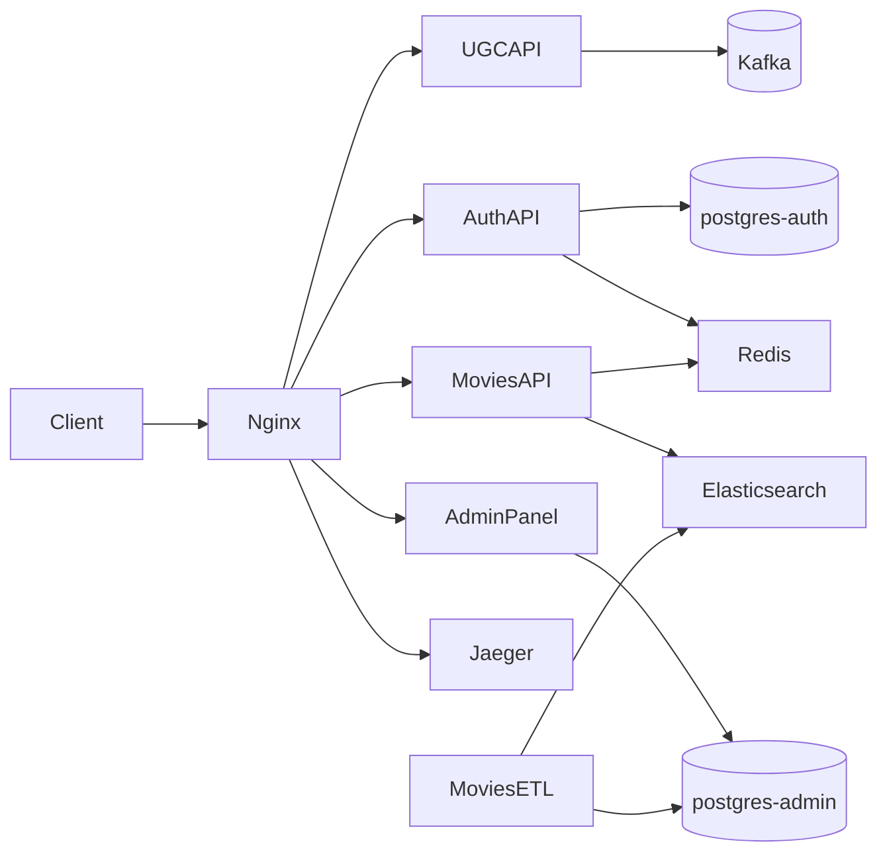

# Online Movie Theater — Integration Project

Diploma project for [Yandex Practicum](https://practicum.yandex.ru/) (sprint 2). The repository wires together five application services into a single platform: content management, catalog API, authentication, ETL, and UGC event ingestion. Nginx acts as the public entry point in production mode; Jaeger collects distributed traces from the auth service.

**Author:** [Artyom Suhov](https://github.com/rock4ts)

## Architecture



| Service | Role |
|---------|------|
| **admin_panel** | Django CMS — films, genres, people; staff admin with external JWT login |
| **auth_api** | FastAPI identity service — users, roles, RS256 JWT, Yandex ID OAuth |
| **movies_api** | FastAPI read API — catalog from Elasticsearch with Redis cache |
| **movies_etl** | Syncs catalog data from PostgreSQL to Elasticsearch indexes |
| **ugc_api** | Flask event ingestion — validates user activity events and publishes them to Kafka |
| **nginx** | Reverse proxy, rate limiting, static files *(production mode only)* |
| **jaeger-tracer** | OpenTelemetry trace storage and UI |
| **postgres-admin** / **postgres-auth** | Separate databases for content and auth |
| **redis** | Rate limiting (auth) and response cache (movies) |
| **elastic-db** | Search indexes: `movies`, `genres`, `persons` |
| **kafka** | Event bus for UGC analytics — topics `ugc-events` and `ugc-anonymous-events` |
| **clickhouse_profiler** | ClickHouse benchmarking toolkit — runs standalone; example results are served via nginx in production mode |

Each application lives in a Git submodule. See [`.gitmodules`](.gitmodules) for source repositories.

## Prerequisites

- Docker and Docker Compose v2
- [just](https://github.com/casey/just) *(optional, for local dev recipes)*
- [uv](https://docs.astral.sh/uv/) *(optional, for running services outside Docker)*

## Initial setup

1. Clone with submodules:

   ```bash
   git clone --recurse-submodules git@github.com:rock4ts/movies_portfolio.git
   cd movies_portfolio
   ```

   If already cloned without submodules:

   ```bash
   git submodule update --init --recursive
   ```

2. Generate JWT keys (required by auth, admin panel, movies API, and UGC API):

   ```bash
   mkdir -p auth-certs
   openssl genrsa -out auth-certs/jwt-private.pem 2048
   openssl rsa -in auth-certs/jwt-private.pem -pubout -out auth-certs/jwt-public.pem
   ```

3. Docker Compose reads environment from `env-files/`. These files are committed with development defaults; adjust credentials or OAuth settings there if needed.

4. Load initial catalog data into the admin database on first run (see [admin_panel/README.md](admin_panel/README.md)).

## Run modes

The project ships two Compose files. They run the same services but differ in networking and how you reach them.

### Production — `docker-compose.yml`

Use this mode to run the **full integrated stack** behind a single HTTP entry point, as it would behave in deployment.

```bash
docker compose up --build -d
docker compose down          # stop and remove containers
```

**Characteristics:**

- **nginx** listens on port **80** and routes all traffic
- Application containers are **not** exposed to the host directly
- Rate limiting on `/movies/api/` — 3 requests/s per IP, burst of 5 (`limit_req zone=one`); on `/ugc/api/` — 5 requests/s per IP, burst of 5 (`limit_req zone=two`)
- Jaeger UI is served under `/tracer/` (via `QUERY_BASE_PATH`)
- Static admin assets are served from `/static/`

| URL | Service |
|-----|---------|
| http://127.0.0.1/admin/ | Django admin panel |
| http://127.0.0.1/admin/api/v1/ | Admin read-only API |
| http://127.0.0.1/admin/docs/ | Admin OpenAPI (Swagger UI) |
| http://127.0.0.1/auth/api/ | Auth API |
| http://127.0.0.1/auth/api/docs | Auth OpenAPI (Swagger UI) |
| http://127.0.0.1/movies/api/ | Movies API |
| http://127.0.0.1/movies/api/docs | Movies OpenAPI (Swagger UI) |
| http://127.0.0.1/ugc/api/v1/events | UGC API — ingest authenticated user events |
| http://127.0.0.1/ugc/api/v1/anonymous-events | UGC API — ingest anonymous user events |
| http://127.0.0.1/ugc/api/docs/swagger | UGC OpenAPI (Swagger UI) |
| http://127.0.0.1/tracer/ | Jaeger UI |
| http://127.0.0.1/architecture/pre-ugc/ | Architecture docs (current stage) |
| http://127.0.0.1/clickhouse/profiler/results | ClickHouse profiler — download example results archive (`results_example.tar.gz`) |

### Development — `docker-compose.dev.yml`

Use this mode for **local debugging** — each service is reachable on its own port without nginx.

```bash
just dev                     # docker compose -f docker-compose.dev.yml up --build -d
just dev-down                # stop development stack
```

Or directly:

```bash
docker compose -f docker-compose.dev.yml up --build -d
docker compose -f docker-compose.dev.yml down
```

**Characteristics:**

- **No nginx** — call services directly by port
- Database, cache, and observability tools are exposed for local tools (psql, Redis CLI, etc.)
- Jaeger UI on the default port (no `/tracer/` prefix)

| URL | Service |
|-----|---------|
| http://127.0.0.1:8000/admin/ | Django admin panel |
| http://127.0.0.1:8080 | Admin OpenAPI (Swagger UI) |
| http://127.0.0.1:8002/docs | Auth API OpenAPI |
| http://127.0.0.1:8001/docs | Movies API OpenAPI |
| http://127.0.0.1:8003/openapi/swagger | UGC API OpenAPI |
| http://127.0.0.1:16686 | Jaeger UI |
| http://127.0.0.1:8081 | Kafka UI |
| localhost:5432 | postgres-admin |
| localhost:5433 | postgres-auth |
| localhost:6379 | Redis |
| localhost:9200 | Elasticsearch |
| localhost:29092 | Kafka (host listener) |

### Hybrid local development

The `justfile` provides recipes to run individual services on the host against Docker infrastructure started with `just dev`:

| Command | Description |
|---------|-------------|
| `just admin-local` | Django dev server |
| `just auth-api-local` | Auth API with hot reload |
| `just movies-api-local` | Movies API with hot reload |
| `just etl-local` | Run ETL once |
| `just elastic-init` | Create Elasticsearch indexes |
| `just admin-psql` | Open psql to admin database |

Copy `.env.example` to `.env.local` in each service directory before using these recipes.

## Architecture documentation

The repository keeps a **versioned record of how the system evolves** — not just the current state, but snapshots of the architecture at each major development stage.

Each stage is a self-contained folder with PlantUML diagrams, a short README, and a static index page. When a new service or capability is added (for example, a UGC module), a new stage folder is created to document the updated architecture while earlier stages remain available for comparison.

```
architecture-raw/              ← manually maintained sources (committed)
├── pre-ugc/
│   ├── components.puml
│   ├── README.md
│   └── index.html
└── ugc/                       ← future stage
    └── …

architecture-rendered/         ← generated output (gitignored, not committed)
├── pre-ugc/
│   ├── components.svg
│   ├── README.md
│   └── index.html
└── …
```

**What goes where:**

| Directory | Purpose |
|-----------|---------|
| `architecture-raw/` | Source files edited by hand — only `.puml` diagrams, `README.md`, and `index.html` |
| `architecture-rendered/` | Auto-generated SVGs and copied static files — listed in `.gitignore`, not committed |

**How to generate rendered docs locally:**

```bash
docker compose -f docker-compose.dev.yml run --rm architecture-renderer
```

This runs the `architecture-renderer` container once, reads from `architecture-raw/`, and writes the result to `architecture-rendered/`. Re-run after editing any source file in `architecture-raw/`.

**How rendering works:**

The `architecture-renderer` container runs `scripts/render_project_schemas.sh`. It recursively scans `architecture-raw/` for `.puml` files, renders each to SVG, and copies non-diagram files (`README.md`, `index.html`) into the output — preserving the directory structure.

| Mode | Input | Output | Access |
|------|-------|--------|--------|
| Production | `./architecture-raw` | `schema_output` volume | http://127.0.0.1/architecture/pre-ugc/ |
| Development | `./architecture-raw` | `./architecture-rendered` | Open files on disk after running the command above |

The current stage is **pre-ugc** — the integrated platform before user-generated content is added. See [architecture-raw/pre-ugc/README.md](architecture-raw/pre-ugc/README.md) for the full description.

## UGC API

[`ugc_api/`](ugc_api/) is the **event ingestion layer** for user-generated content analytics. Frontend clients send behavioral events — clicks, page views, movie interactions, search filters — over HTTP. The service validates each payload, verifies JWTs for authenticated users, and publishes accepted events to Kafka for downstream processing.

| Endpoint | Auth | Description |
|----------|------|-------------|
| `POST /ugc/api/v1/events` | Bearer JWT | Ingest one authenticated user event (`user_id` must match token `sub`) |
| `POST /ugc/api/v1/anonymous-events` | None | Ingest one anonymous event (client-generated `anonymous_id`) |

Authenticated events go to the `ugc-events` topic (partition key: `user_id`); anonymous events go to `ugc-anonymous-events` (partition key: `anonymous_id`). Kafka topics are created automatically on stack startup by the `kafka-init` job.

Environment for the integrated stack lives in [`env-files/.env.ugc-api`](env-files/.env.ugc-api). For API details, supported event types, curl examples, and functional tests, see [ugc_api/README.md](ugc_api/README.md).

## ClickHouse profiler

[`clickhouse_profiler/`](clickhouse_profiler/) is a standalone ClickHouse benchmarking toolkit used to profile workloads. It ships its own Compose stack (ClickHouse, synthetic dataset loader, and a scenario-based profiler CLI) and is **not** started by the main `docker compose up` command.

Run benchmarks locally:

```bash
cd clickhouse_profiler
docker compose up --build
```

Each scenario writes timestamped output under `results/<scenario>/<timestamp>/`. The repository includes a pre-built sample archive at `clickhouse_profiler/results_example.tar.gz`.

In **production mode**, nginx exposes a download endpoint for that archive:

| URL | Response |
|-----|----------|
| http://127.0.0.1/clickhouse/profiler/results | `application/gzip` attachment named `results_example.tar.gz` |

The endpoint is static file delivery only — it does not run the profiler. See clickhouse_profiler's README.md for scenarios, configuration, and how to generate fresh results.

## Implemented features

- **Unified auth** — admin panel login delegates to `auth_api`; superusers registered via auth are provisioned locally on first login. A break-glass local account remains available if auth is down.
- **Distributed tracing** — auth service exports OpenTelemetry spans to Jaeger; HTTP spans include `http.request_id` from the `X-Request-Id` header set by nginx.
- **Rate limiting** — nginx token bucket on movies API (3 req/s, burst 5) and UGC API (5 req/s, burst 5); Redis-based per-IP limits on sensitive auth endpoints.
- **UGC event ingestion** — validated user activity events published to Kafka; separate topics and partition keys for authenticated and anonymous users.
- **Yandex ID OAuth** — `/auth/api/yandexid/login` and `/auth/api/yandexid/token`.

## Source repositories

- [Integration repo](https://github.com/rock4ts/movies_portfolio)
- [Movies API](https://github.com/rock4ts/Async_API_sprint_2)
- [Admin panel](https://github.com/rock4ts/new_admin_panel_sprint_2)
- [Auth API](https://github.com/rock4ts/Auth_sprint_1)
- [UGC API](https://github.com/rock4ts/movies_ugc_api)
- [Clickhouse profiler](https://github.com/rock4ts/clickhouse_profiler.git)
