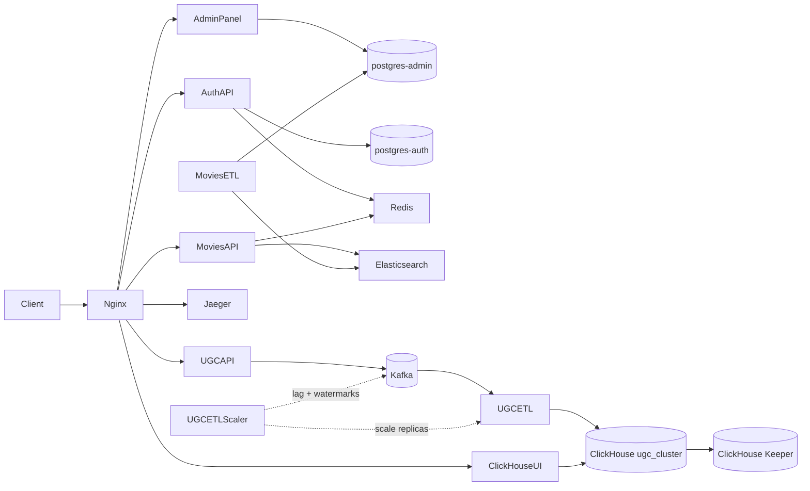

# Онлайн-кинотеатр — интеграционный проект

[English](README.en.md)

Репозиторий объединяет прикладные сервисы в единую платформу: управление контентом, API каталога, аутентификация, ETL каталога, приём UGC-событий и аналитический UGC ETL с автомасштабированием по лагу. Nginx — публичная точка входа в production-режиме; Jaeger собирает распределённые трейсы сервиса аутентификации.
В основу сервисов легли задания из курса Мидл Python-разработчик [Яндекс Практикума](https://practicum.yandex.ru/)

**Автор:** [Артём Сухов](https://github.com/rock4ts)

## Архитектура



| Сервис | Роль |
|--------|------|
| **admin_panel** | Django CMS — фильмы, жанры, персоны; админка для сотрудников с внешним JWT-логином |
| **auth_api** | FastAPI-сервис идентичности — пользователи, роли, RS256 JWT, OAuth Яндекс ID |
| **movies_api** | FastAPI read API — каталог из Elasticsearch с кэшем в Redis |
| **movies_etl** | Синхронизирует данные каталога из PostgreSQL в индексы Elasticsearch |
| **ugc_api** | Flask-приём событий — валидирует события пользовательской активности и публикует их в Kafka |
| **ugc_etl** | Масштабируемый Kafka-консьюмер — батчами пишет UGC-события в ClickHouse |
| **ugc_etl_scaler** | Скейлер только для production (по cron) — меняет число реплик `ugc-etl` по лагу Kafka и скорости входящего потока |
| **nginx** | Обратный прокси, rate limiting, статика *(только production)* |
| **jaeger-tracer** | Хранение OpenTelemetry-трейсов и UI |
| **postgres-admin** / **postgres-auth** | Отдельные БД для контента и аутентификации |
| **redis** | Rate limiting (auth) и кэш ответов (movies) |
| **elastic-db** | Поисковые индексы: `movies`, `genres`, `persons` |
| **kafka** | Шина событий для UGC-аналитики — топики `ugc-events` и `ugc-anonymous-events` |
| **clickhouse** | Реплицированное и шардированное аналитическое хранилище для пяти типов UGC-событий |
| **clickhouse-keeper** | Координация репликации ClickHouse и распределённого DDL |
| **clickhouse-ui** | Веб-UI для просмотра и запросов к кластеру ClickHouse |
| **clickhouse_profiler** | Отдельный бенчмарк кластерного ClickHouse с зафиксированными примерами результатов |
| **pg_vs_mongo** | Отдельный микробенчмарк PostgreSQL vs MongoDB для UGC с зафиксированными результатами latency |
| **billing_service** | Платежи и возвраты через ЮKassa — FastAPI API + poller статусов *(в процессе доработки)* |
| **email_api** | FastAPI-приём задач на отправку email в RabbitMQ *(в процессе доработки)* |
| **email_dispatcher** | Асинхронный SMTP-воркер — консьюмер RabbitMQ, статус доставки в MongoDB *(в процессе доработки)* |
| **notification_api** | FastAPI-события уведомлений и короткие ссылки — producer в RabbitMQ, PostgreSQL *(в процессе доработки)* |
| **notification_ws** | WebSocket-доставка уведомлений с JWT-аутентификацией *(в процессе доработки)* |
| **ugc_api_mongo** | FastAPI UGC API на MongoDB — лайки, рецензии, закладки *(в процессе доработки)* |

Каждое приложение живёт в Git-сабмодуле. Источники — в [`.gitmodules`](.gitmodules).

> **В процессе доработки:** `billing_service`, `email_api`, `email_dispatcher`, `notification_api`, `notification_ws` и `ugc_api_mongo` уже подключены как сабмодули и активно дорабатываются. В основные стеки `docker-compose.yml` / `docker-compose.dev.yml` они **ещё не интегрированы**.

## Требования

- Docker и Docker Compose v2
- [just](https://github.com/casey/just) *(опционально, для локальных рецептов)*
- [uv](https://docs.astral.sh/uv/) *(опционально, для запуска сервисов вне Docker)*

## Первичная настройка

1. Клонируйте репозиторий вместе с сабмодулями:

   ```bash
   git clone --recurse-submodules git@github.com:rock4ts/movies_portfolio.git
   cd movies_portfolio
   ```

   Если уже клонировали без сабмодулей:

   ```bash
   git submodule update --init --recursive
   ```

2. Сгенерируйте JWT-ключи (нужны auth, admin panel, movies API и UGC API):

   ```bash
   mkdir -p auth-certs
   openssl genrsa -out auth-certs/jwt-private.pem 2048
   openssl rsa -in auth-certs/jwt-private.pem -pubout -out auth-certs/jwt-public.pem
   ```

3. Docker Compose читает окружение из `env-files/`. Файлы закоммичены с дефолтами для разработки; при необходимости поправьте учётные данные или настройки OAuth.

4. При первом запуске загрузите начальные данные каталога в БД админки (см. [admin_panel/README.md](admin_panel/README.md)).

## Режимы запуска

В проекте два основных Compose-файла. Они поднимают одни и те же прикладные сервисы, но с разным размером кластера ClickHouse и сетевой схемой.

### Production — `docker-compose.yml`

Этот режим поднимает **полный интегрированный стек** за единой HTTP-точкой входа — как в деплое.

```bash
docker compose up --build -d
docker compose down          # остановить и удалить контейнеры
```

**Особенности:**

- **nginx** слушает порт **80** и маршрутизирует весь трафик
- Контейнеры приложений **не** проброшены на хост напрямую
- Rate limiting на `/movies/api/` — 3 запроса/с на IP, burst 5 (`limit_req zone=one`); на `/ugc/api/` — 5 запросов/с на IP, burst 5 (`limit_req zone=two`)
- UI Jaeger доступен по `/tracer/` (через `QUERY_BASE_PATH`)
- Статика админки отдаётся с `/static/`
- ClickHouse: два шарда по две реплики, координируются тремя нодами Keeper
- Порты серверов ClickHouse остаются внутренними; nginx отдаёт ClickHouse UI по `/ch-ui/`
- `ugc-etl-scaler` работает постоянно, чтобы хостовый cron мог запускать решения о масштабировании через `docker compose exec`

| URL | Сервис |
|-----|--------|
| http://127.0.0.1/admin/ | Django-админка |
| http://127.0.0.1/admin/api/v1/ | Read-only API админки |
| http://127.0.0.1/admin/docs/ | OpenAPI админки (Swagger UI) |
| http://127.0.0.1/auth/api/ | Auth API |
| http://127.0.0.1/auth/api/docs | OpenAPI Auth (Swagger UI) |
| http://127.0.0.1/movies/api/ | Movies API |
| http://127.0.0.1/movies/api/docs | OpenAPI Movies (Swagger UI) |
| http://127.0.0.1/ugc/api/v1/events | UGC API — приём событий аутентифицированных пользователей |
| http://127.0.0.1/ugc/api/v1/anonymous-events | UGC API — приём анонимных событий |
| http://127.0.0.1/ugc/api/docs/swagger | OpenAPI UGC (Swagger UI) |
| http://127.0.0.1/tracer/ | Jaeger UI |
| http://127.0.0.1/architecture/pre-ugc/ | Документация архитектуры (текущий этап) |
| http://127.0.0.1/ch-ui/ | ClickHouse UI |

### Development — `docker-compose.dev.yml`

Режим для **локальной отладки** — каждый сервис доступен на своём порту без nginx.

```bash
just dev                     # docker compose -f docker-compose.dev.yml up --build -d
just dev-down                # остановить development-стек
```

Или напрямую:

```bash
docker compose -f docker-compose.dev.yml up --build -d
docker compose -f docker-compose.dev.yml down
```

**Особенности:**

- **Без nginx** — сервисы вызываются напрямую по портам
- БД, кэш и инструменты наблюдаемости открыты для локальных утилит (psql, Redis CLI и т.д.)
- Jaeger UI на стандартном порту (без префикса `/tracer/`)
- ClickHouse: один шард с двумя репликами и одной нодой Keeper

| URL | Сервис |
|-----|--------|
| http://127.0.0.1:8000/admin/ | Django-админка |
| http://127.0.0.1:8080 | OpenAPI админки (Swagger UI) |
| http://127.0.0.1:8002/docs | OpenAPI Auth API |
| http://127.0.0.1:8001/docs | OpenAPI Movies API |
| http://127.0.0.1:8003/openapi/swagger | OpenAPI UGC API |
| http://127.0.0.1:16686 | Jaeger UI |
| http://127.0.0.1:8081 | Kafka UI |
| http://127.0.0.1:3488 | ClickHouse UI |
| localhost:5432 | postgres-admin |
| localhost:5433 | postgres-auth |
| localhost:6379 | Redis |
| localhost:9200 | Elasticsearch |
| localhost:29092 | Kafka (слушатель на хосте) |
| localhost:8123 / localhost:9000 | ClickHouse node 1 — HTTP / native TCP |
| localhost:8124 / localhost:9001 | ClickHouse node 2 — HTTP / native TCP |

## Документация архитектуры

В репозитории хранится **версионированная история эволюции системы** — не только текущее состояние, но и снимки архитектуры на каждом крупном этапе разработки.

Каждый этап — отдельная папка с диаграммами PlantUML и коротким README. Когда добавляется новый сервис или возможность (например, модуль UGC), создаётся новая папка этапа с обновлённой архитектурой; предыдущие этапы остаются для сравнения. Общие HTML-шаблоны в корне `architecture-raw/` копируются в каждый этап при рендере; `readme.html` загружает `README.md` этапа в браузере и отображает его как HTML.

```
architecture-raw/              ← источники, правятся вручную (в git)
├── index.html                 ← общий индекс этапа (копируется в каждый этап при рендере)
├── readme.html                ← общий Markdown-просмотрщик (загружает README.md в браузере)
├── pre-ugc/
│   ├── components.puml
│   └── README.md
└── ugc/                       ← следующий этап
    └── …

architecture-rendered/         ← сгенерированный вывод (в .gitignore, не коммитится)
├── pre-ugc/
│   ├── components.svg
│   ├── README.md
│   ├── index.html             ← установлен из общего шаблона
│   └── readme.html            ← установлен из общего шаблона
└── …
```

**Что куда класть:**

| Каталог | Назначение |
|---------|------------|
| `architecture-raw/` | Исходники, редактируемые вручную — диаграммы `.puml`, `README.md` по этапам и общие корневые `index.html` / `readme.html` |
| `architecture-rendered/` | Автогенерируемые SVG, скопированные README и общие HTML по этапам — в `.gitignore`, не коммитятся |

**Как сгенерировать отрендеренные docs локально:**

```bash
docker compose -f docker-compose.dev.yml run --rm architecture-renderer
```

Контейнер `architecture-renderer` запускается один раз, читает `architecture-raw/` и пишет результат в `architecture-rendered/`. Повторяйте после правок любого исходника в `architecture-raw/`.

**Как устроен рендер:**

Контейнер `architecture-renderer` выполняет `scripts/render_project_schemas.sh`. Скрипт рекурсивно ищет `.puml` в `architecture-raw/`, рендерит каждый в SVG, копирует не-диаграммные файлы (кроме общих HTML-шаблонов) в вывод и устанавливает `index.html` и `readme.html` в каталог каждого этапа.

| Режим | Вход | Выход | Доступ |
|-------|------|-------|--------|
| Production | `./architecture-raw` | том `schema_output` | http://127.0.0.1/architecture/pre-ugc/ |
| Development | `./architecture-raw` | `./architecture-rendered` | Открыть файлы на диске после команды выше |

Текущий этап — **pre-ugc**: интегрированная платформа до добавления пользовательского контента. Полное описание — в [architecture-raw/pre-ugc/README.md](architecture-raw/pre-ugc/README.md).

## Реализованные возможности

Подразделы идут в порядке реализации: сначала CMS и read-путь каталога, затем идентичность и периметр, затем стек UGC-аналитики. Сервисы, которые ещё дорабатываются и интегрируются, перечислены в конце в разделе [В процессе доработки](#в-процессе-доработки--биллинг-уведомления-email-ugc-на-mongodb).

### Админ-панель

[`admin_panel/`](admin_panel/) — **источник истины** для метаданных фильмов: названия, описания, рейтинги, жанры и актёрский состав / съёмочная группа. Сотрудники ведут каталог в Django Admin; небольшой read-only REST API отдаёт фильмы в JSON.

| Поверхность | Роль |
|-------------|------|
| `/admin/` | CMS для фильмов/сериалов, жанров и персон (актёры, режиссёры, сценаристы) |
| `GET /admin/api/v1/movies/` | Постраничный список фильмов с жанрами и составом |
| `GET /admin/api/v1/movies/<uuid>` | Один фильм по ID |

Логин админки делегирует проверку учётных данных в `auth_api`. После успеха панель проверяет RS256 JWT общим публичным ключом и создаёт локального `User` (email + staff). Принимаются только токены с `is_superuser: true`. Break-glass локальный аккаунт остаётся на случай недоступности auth. Успешные входы пишутся в append-only журнал `AdminLoginLog`.

Начальные данные каталога — в `database_dump.sql` (загрузка через `LOAD_DATABASE_DUMP=true` в Docker или вручную). Подробности: [admin_panel/README.md](admin_panel/README.md).

### Movies ETL

[`movies_etl/`](movies_etl/) непрерывно синхронизирует изменения каталога из `postgres-admin` в индексы Elasticsearch `movies`, `genres` и `persons`. Параллельные пайплайны покрывают filmwork (напрямую и по person/genre), жанры и персон. Прогресс между циклами хранится в файловом watermark (`STATE_FILE_PATH`).

`PRODUCER_LIMIT` / `GENRE_PRODUCER_LIMIT` ограничивают число изменённых строк на цикл; `*_SLEEP` задают паузу между циклами (`0` — для локальной разработки). Запуск: `python -m app.main`. Подробности: [movies_etl/README.md](movies_etl/README.md).

### Movies API

[`movies_api/`](movies_api/) — **read-оптимизированный API каталога**. Читает индексы Elasticsearch, заполненные movies ETL, и кэширует ответы в Redis.

| Метод | Путь | Описание |
|-------|------|----------|
| `GET` | `/movies/api/v1/films/` | Постраничный список с фильтром по жанру и сортировкой по рейтингу |
| `GET` | `/movies/api/v1/films/search` | Полнотекстовый поиск по названию |
| `GET` | `/movies/api/v1/films/<uuid>` | Карточка фильма (с контролем доступа) |
| `GET` | `/movies/api/v1/genres/` | Список жанров |
| `GET` | `/movies/api/v1/persons/search` | Поиск персон |
| `GET` | `/movies/api/v1/persons/<uuid>/films` | Фильмы, связанные с персоной |

Карточка фильма сверяет `access_label` фильма (`free` / `premium` / `vip`) с JWT-клеймом `access_labels` вызывающего. Анонимные клиенты видят только `free`; `is_superuser=true` — без ограничений. Токены проверяются офлайн публичным ключом auth. Подробности: [movies_api/README.md](movies_api/README.md).

### Auth API

[`auth_api/`](auth_api/) — **слой идентичности и доступа**. Регистрирует пользователей, выдаёт RS256 access-токены и refresh-cookie, управляет ролями с `access_labels` (`free` / `premium` / `vip`) и ведёт партиционированную историю логинов.

| Область | Эндпоинты |
|---------|-----------|
| Auth | `POST /auth/api/token`, `/refresh`, `/logout`, `/logout-others` |
| Users | `POST /auth/api/users`, `GET /users/me`, смена email/пароля, история логинов |
| Roles | CRUD и assign/revoke (только superuser) |
| Яндекс ID | `GET /auth/api/yandexid/login`, `GET /auth/api/yandexid/token` |

Refresh-токены блокируются через Redis; чувствительные маршруты лимитируются per-IP. Сервис экспортирует OpenTelemetry-спаны в Jaeger. Downstream-сервисы (`admin_panel`, `movies_api`, `ugc_api`) проверяют JWT локально смонтированным публичным ключом. Подробности: [auth_api/README.md](auth_api/README.md).

### Периметр платформы (nginx, трейсинг, rate limiting)

В production **nginx** — единая публичная точка входа на порту 80: маршрутизация на admin, auth, movies, UGC, Jaeger и ClickHouse UI, статика админки с `/static/`, заголовок `X-Request-Id` для корреляции запросов.

Rate limiting — token bucket nginx: `/movies/api/` — 3 req/s на IP (burst 5); `/ugc/api/` — 5 req/s на IP (burst 5). Auth дополнительно лимитирует чувствительные эндпоинты per-IP через Redis.

**Распределённый трейсинг:** `auth_api` экспортирует OTLP-спаны в Jaeger; HTTP-спаны включают `http.request_id` из заголовка `X-Request-Id` от nginx. Jaeger UI в production доступен по `/tracer/` (`QUERY_BASE_PATH`).

### UGC API

[`ugc_api/`](ugc_api/) — **слой приёма событий** для аналитики пользовательского контента. Фронтенд-клиенты отправляют поведенческие события — клики, просмотры страниц, взаимодействия с фильмами, поисковые фильтры — по HTTP. Сервис валидирует каждый payload, проверяет JWT для аутентифицированных пользователей и публикует принятые события в Kafka для дальнейшей обработки.

| Эндпоинт | Auth | Описание |
|----------|------|----------|
| `POST /ugc/api/v1/events` | Bearer JWT | Приём одного события аутентифицированного пользователя (`user_id` должен совпадать с `sub` токена) |
| `POST /ugc/api/v1/anonymous-events` | Нет | Приём одного анонимного события (клиентский `anonymous_id`) |

Аутентифицированные события идут в топик `ugc-events` (ключ партиции: `user_id`); анонимные — в `ugc-anonymous-events` (ключ партиции: `anonymous_id`). Топики Kafka и dead-letter топик `ugc-events-dlq` создаются автоматически при старте стека джобой `kafka-init`.

Окружение интегрированного стека — в [`env-files/.env.ugc-api`](env-files/.env.ugc-api). Детали API, поддерживаемые типы событий, примеры curl и функциональные тесты — в [ugc_api/README.md](ugc_api/README.md).

### Аналитический кластер ClickHouse

Основной стек включает деплой ClickHouse `ugc_cluster` через Compose `include`:

| Режим | Compose include | Топология | Доступ с хоста |
|-------|-----------------|-----------|----------------|
| Production | [`docker-compose.ch.yaml`](docker-compose.ch.yaml) | 4 ноды ClickHouse: 2 шарда × 2 реплики; 3 ноды Keeper | ClickHouse UI через nginx на `/ch-ui/` |
| Development | [`docker-compose.ch-dev.yaml`](docker-compose.ch-dev.yaml) | 2 ноды ClickHouse: 1 шард × 2 реплики; 1 нода Keeper | UI на `:3488`; открыты HTTP/native-порты |

Оба режима берут конфигурацию нод из [`clickhouse/{prod,dev}/`](clickhouse/) и учётные данные из [`env-files/.env.clickhouse`](env-files/.env.clickhouse). После того как все ноды ClickHouse становятся healthy, one-shot сервис `clickhouse-init` применяет SQL из [`clickhouse/init/`](clickhouse/init/) по всему кластеру.

SQL с Replacing-движком применяется при первой инициализации таблиц. Существующие MergeTree-таблицы `CREATE TABLE IF NOT EXISTS` не меняет; перед расчётом на eventual схлопывание дубликатов пересоздайте или мигрируйте существующие UGC-таблицы.

Инициализация создаёт:

- пару таблиц сырого приёма: `events_raw_local` и distributed `events_raw` (сырые строки истекают через 14 дней: `TTL ingested_at + INTERVAL 14 DAY DELETE`)
- пять пар таблиц событий назначения: `click_events`, `page_view_events`, `movie_quality_changed_events`, `movie_completed_events` и `search_filter_used_events`
- по одному materialized view на каждый тип события назначения: читает `events_raw_local` и пишет в соответствующую `<name>_local`

Целевой write-путь ETL — `ugc.events_raw`. Дальше ClickHouse маршрутизирует строки по `event_type` в типизированные локальные таблицы; аналитические чтения идут через distributed-таблицы назначения. Данные партиционированы по месяцам, распределены по `cityHash64(actor_id)` и упорядочены для аналитики по актору или фильму.

### Профайлер ClickHouse

[`clickhouse_profiler/`](clickhouse_profiler/) — отдельный инструментарий бенчмарков и **не** стартует командой `docker compose up` основного стека. Его Compose-стек повторяет production-топологию: четыре ноды ClickHouse как два реплицированных шарда, три ноды Keeper, загрузчик синтетического датасета и сценарный профайлер.

Запуск бенчмарков локально:

```bash
cd clickhouse_profiler
docker compose up --build
```

Сценарий `write_read` перебирает комбинации writer-thread и insert-batch, пока aggregation-ридеры запрашивают ту же distributed-таблицу. Отчёт включает throughput записи вместе со средней, p95 и максимальной latency запросов.

Каждый прогон пишет:

```text
results/write_read/<timestamp>/
├── metadata.json
└── profile.csv
```

Закоммиченные примеры — в [`clickhouse_profiler/results_example/`](clickhouse_profiler/results_example/). Детали нагрузки, конфигурация и инструкции по генерации свежих результатов — в [README профайлера](clickhouse_profiler/README.md).

### Бенчмарк PostgreSQL vs MongoDB для UGC

[`pg_vs_mongo/`](pg_vs_mongo/) — отдельный микробенчмарк и **не** стартует командой `docker compose up` основного стека. Сравнивает PostgreSQL 15 и MongoDB на одинаковой UGC-нагрузке — лайки, рецензии и закладки — с генерацией синтетических данных (до ~10 млн лайков), сопоставимыми индексами и пятью latency-сценариями.

Запуск бенчмарка локально:

```bash
cd pg_vs_mongo
docker compose up -d
python populate.py
python load_testing.py
```

Результаты пишутся в `load_test_results.json`. Закоммиченный пример лежит в том же каталоге. Исследование обосновало выбор polyglot persistence для UGC (MongoDB для лайков/дизлайков; PostgreSQL для рецензий и закладок). Детали и выводы по сценариям — в [pg_vs_mongo/README.md](pg_vs_mongo/README.md).

### UGC ETL и автомасштабирование по лагу

[`ugc_etl/`](ugc_etl/) читает оба UGC-топика как consumer group `ugc-etl`. Воркеры валидируют конверты событий, батчами вставляют данные в `ugc.events_raw`, отправляют битые записи в `ugc-events-dlq` и коммитят офсеты Kafka только после обработки всех записей батча. Доставка — at least once. Replacing-таблицы ClickHouse со временем схлопывают дубликаты повторных попыток с одним и тем же стабильным ключом события. Ранбуки unit- и функциональных тестов — в [`ugc_etl/README.md`](ugc_etl/README.md).

Запуск одного воркера вручную:

```bash
docker compose up -d --build --scale ugc-etl=1 ugc-etl
```

Сейчас у UGC-топиков по три партиции. [`ugc_etl_scaler/`](ugc_etl_scaler/) поднимается вместе с production-стеком; хостовый cron (или оператор) запускает по одному решению о масштабировании через `docker compose exec`. Каждый запуск запрашивает consumer lag и high watermark партиций напрямую из Kafka и меняет только число реплик `ugc-etl`. Лаг на партицию: `high_watermark - effective_offset`, где effective offset — закоммиченный офсет, если он есть, иначе low watermark брокера (`OFFSET_INVALID`, `None` или отрицательный) — в соответствии с `auto.offset.reset=earliest` у ETL-консьюмера. Верхняя граница воркеров: `min(MAX_WORKERS, total_partitions)`.

```bash
# Держать контейнер скейлера запущенным в фоне
docker compose up -d --build ugc-etl-scaler

# Выполнить одно решение скейлера внутри этого контейнера
docker compose exec -T ugc-etl-scaler python -m app.main

# Превью решения без изменения реплик
docker compose exec -T -e DRY_RUN=true ugc-etl-scaler python -m app.main
```

Из замеров insert-throughput сценария `write_read` в [`clickhouse_profiler/`](clickhouse_profiler/) (примеры в [`results_example/`](clickhouse_profiler/results_example/)) выведены два параметра пропускной способности: `SINGLE_WORKER_THROUGHPUT=150000` и `ADDITIONAL_WORKER_THROUGHPUT=15000`. Прогон шёл на кластере ClickHouse профайлера по умолчанию — суммарно **8 CPU и 8 GB RAM** (4 ноды × 2 CPU / 2 GB) — с insert **batch size 50000**, как у `ETL_BATCH_SIZE` у `ugc-etl`.


Политика по умолчанию: `MIN_WORKERS=1`, `MAX_WORKERS=4`, `SINGLE_WORKER_THROUGHPUT=150000`, `ADDITIONAL_WORKER_THROUGHPUT=15000`, `TARGET_DRAIN_SECONDS=600`, `TARGET_UTILIZATION=0.8`, `SCALE_DOWN_UTILIZATION=0.6`.


Поведение масштабирования:

- число воркеров ниже `MIN_WORKERS` восстанавливается до оценки скорости
- требуемая скорость = входящая скорость Kafka + lag / окно drain
- модель ёмкости: `SINGLE_WORKER_THROUGHPUT + ADDITIONAL_WORKER_THROUGHPUT × (workers - 1)`
- scale up сразу до минимального числа воркеров, удовлетворяющего целевой утилизации
- scale down по одному воркеру, когда спрос остаётся ниже порога scale-down
- первый запуск (или отсутствие baseline) сохраняет high watermark партиций и пропускает масштабирование по спросу до следующего наблюдения
- по умолчанию одно событие Kafka соответствует одной вставленной строке ClickHouse
- пятиминутный cooldown по-прежнему подавляет частые rescale
- dry-run опрашивает Docker и Kafka, но не меняет реплики и не обновляет cooldown / watermark
- сбои Docker/Kafka/запросов не приводят к изменению масштаба

Все границы задаются в [`env-files/.env.ugc-etl-scaler`](env-files/.env.ugc-etl-scaler) через переменные без префикса: `MIN_WORKERS`, `MAX_WORKERS`, `SINGLE_WORKER_THROUGHPUT`, `ADDITIONAL_WORKER_THROUGHPUT`, `TARGET_DRAIN_SECONDS`, `TARGET_UTILIZATION`, `SCALE_DOWN_UTILIZATION`, `COOLDOWN_SECONDS`. Compose переопределяет `PROJECT_DIR` в `${PWD}` и монтирует тот же путь с хоста.

Добавьте cron на хосте раз в минуту. Держите `ugc-etl-scaler` запущенным в составе стека и каждую минуту выполняйте команду скейлера через `docker compose exec`. Через Docker socket контейнер управляет демоном на хосте; именованный том `ugc_etl_scaler_state` сохраняет lock, cooldown и baseline watermark между запусками.

```cron
* * * * * cd /absolute/path/to/movies_portfolio && /usr/local/bin/docker compose exec -T ugc-etl-scaler python -m app.main >> /tmp/ugc-etl-scaler.log 2>&1
```

`ugc-etl-scaler` в этом проекте только для production и не используется с development-стеком.

Полная конфигурация, ранбуки unit- и функциональных тестов и описание запуска
этих тестов в GitHub Actions — в
[`ugc_etl_scaler/README.md`](ugc_etl_scaler/README.md).

Чтобы откатить автомасштабирование, удалите запись cron и явно задайте число воркеров:

```bash
docker compose up -d --no-deps --scale ugc-etl=1 ugc-etl
```

### В процессе доработки — биллинг, уведомления, email, UGC на MongoDB

Следующие сервисы недавно добавлены как Git-сабмодули. Они **находятся в процессе доработки и пока не интегрированы** в основные Compose-стеки (`docker-compose.yml`, `docker-compose.dev.yml`). Маршрутизация через nginx, общие env-файлы и сквозная интеграция в платформу ещё в работе. Каждый сервис можно изучать в своём каталоге (у части есть локальный Compose).

| Сервис | Роль |
|--------|------|
| [`billing_service/`](billing_service/) | API платежей и возвратов с интеграцией ЮKassa, Redis, RabbitMQ и фоновым poller статусов |
| [`email_api/`](email_api/) | FastAPI-эндпоинт, ставящий задачи на отправку email в очередь RabbitMQ |
| [`email_dispatcher/`](email_dispatcher/) | Асинхронный воркер RabbitMQ: отправка через SMTP и фиксация статуса в MongoDB (topic routing, DLX/DLQ, ограниченные повторы) |
| [`notification_api/`](notification_api/) | FastAPI REST API событий уведомлений и коротких ссылок — PostgreSQL/Alembic и producer в RabbitMQ |
| [`notification_ws/`](notification_ws/) | WebSocket-сервер: потребляет сообщения уведомлений и доставляет их JWT-аутентифицированным клиентам |
| [`ugc_api_mongo/`](ugc_api_mongo/) | FastAPI UGC API на MongoDB для лайков, рецензий и закладок (CRUD/upsert, пагинация, агрегация рейтингов) |

Сопутствующие черновики той же волны работ (тоже вне основного стека): [`elk/`](elk/) (черновики конфигов Filebeat/Logstash для централизованного логирования).

## Исходные репозитории

- [Интеграционный репозиторий](https://github.com/rock4ts/movies_portfolio)
- [Movies API](https://github.com/rock4ts/movies_api.git)
- [Админ-панель](https://github.com/rock4ts/movies_admin_panel.git)
- [Auth API](https://github.com/rock4ts/movies_auth_api.git)
- [UGC API](https://github.com/rock4ts/movies_ugc_api)
- [UGC ETL](https://github.com/rock4ts/movies_ugc_etl)
- [UGC ETL scaler](https://github.com/rock4ts/movies_ugc_etl_scaler)
- [ClickHouse profiler](https://github.com/rock4ts/clickhouse_profiler.git)
- [Billing service](https://github.com/rock4ts/movies_billing.git)
- [Email API](https://github.com/rock4ts/movies_email_api.git)
- [Email dispatcher](https://github.com/rock4ts/movies_email_dispatcher.git)
- [Notification API](https://github.com/rock4ts/movies_notification_api.git)
- [Notification WebSocket](https://github.com/rock4ts/movies_notification_ws.git)
- [UGC API Mongo](https://github.com/rock4ts/movies_ugc_api_mongo.git)
