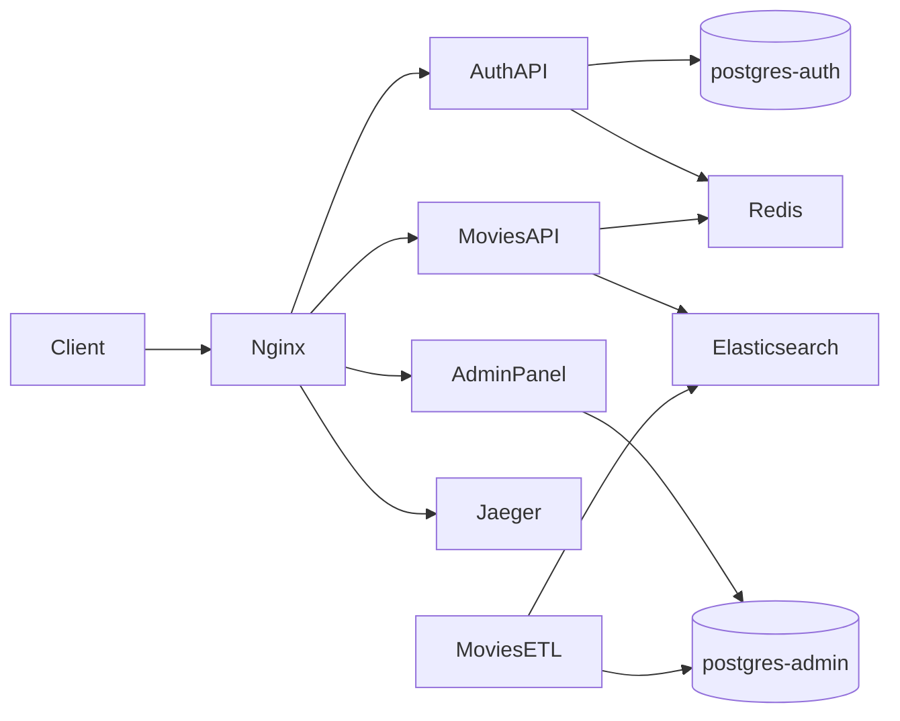

# Online Movie Theater — Integration Project

Diploma project for [Yandex Practicum](https://practicum.yandex.ru/) (sprint 2). The repository wires together four services into a single platform: content management, catalog API, authentication, and ETL. Nginx acts as the public entry point in production mode; Jaeger collects distributed traces from the auth service.

**Author:** [Artyom Suhov](https://github.com/rock4ts)

## Architecture



| Service | Role |
|---------|------|
| **admin_panel** | Django CMS — films, genres, people; staff admin with external JWT login |
| **auth_api** | FastAPI identity service — users, roles, RS256 JWT, Yandex ID OAuth |
| **movies_api** | FastAPI read API — catalog from Elasticsearch with Redis cache |
| **movies_etl** | Syncs catalog data from PostgreSQL to Elasticsearch indexes |
| **nginx** | Reverse proxy, rate limiting, static files *(production mode only)* |
| **jaeger-tracer** | OpenTelemetry trace storage and UI |
| **postgres-admin** / **postgres-auth** | Separate databases for content and auth |
| **redis** | Rate limiting (auth) and response cache (movies) |
| **elastic-db** | Search indexes: `movies`, `genres`, `persons` |

Each application lives in a Git submodule. See [`.gitmodules`](.gitmodules) for source repositories.

## Prerequisites

- Docker and Docker Compose v2
- [just](https://github.com/casey/just) *(optional, for local dev recipes)*
- [uv](https://docs.astral.sh/uv/) *(optional, for running services outside Docker)*

## Initial setup

1. Clone with submodules:

   ```bash
   git clone --recurse-submodules git@github.com:rock4ts/yap2_diploma.git
   cd yap2_diploma
   ```

   If already cloned without submodules:

   ```bash
   git submodule update --init --recursive
   ```

2. Generate JWT keys (required by auth, admin panel, and movies API):

   ```bash
   mkdir -p auth-certs
   openssl genrsa -out auth-certs/jwt-private.pem 2048
   openssl rsa -in auth-certs/jwt-private.pem -pubout -out auth-certs/jwt-public.pem
   ```

3. Docker Compose reads environment from `env-files/`. These files are committed with development defaults; adjust credentials or OAuth settings there if needed.

4. Load initial catalog data into the admin database on first run (see [admin_panel/README.md](admin_panel/README.md)).

## Run modes

The project ships two Compose files. They run the same services but differ in networking and how you reach them.

### Production — `docker-compose.yml`

Use this mode to run the **full integrated stack** behind a single HTTP entry point, as it would behave in deployment.

```bash
docker compose up --build -d
docker compose down          # stop and remove containers
```

**Characteristics:**

- **nginx** listens on port **80** and routes all traffic
- Application containers are **not** exposed to the host directly
- Rate limiting on `/movies/api/` — 1 request/s per IP, bucket of 5 (`limit_req` in nginx)
- Jaeger UI is served under `/tracer/` (via `QUERY_BASE_PATH`)
- Static admin assets are served from `/static/`

| URL | Service |
|-----|---------|
| http://127.0.0.1/admin/ | Django admin panel |
| http://127.0.0.1/admin/api/v1/ | Admin read-only API |
| http://127.0.0.1/admin/docs/ | Admin OpenAPI (Swagger UI) |
| http://127.0.0.1/auth/api/ | Auth API |
| http://127.0.0.1/auth/api/docs | Auth OpenAPI (Swagger UI) |
| http://127.0.0.1/movies/api/ | Movies API |
| http://127.0.0.1/movies/api/docs | Movies OpenAPI (Swagger UI) |
| http://127.0.0.1/tracer/ | Jaeger UI |

### Development — `docker-compose.dev.yml`

Use this mode for **local debugging** — each service is reachable on its own port without nginx.

```bash
just dev                     # docker compose -f docker-compose.dev.yml up --build -d
just dev-down                # stop development stack
```

Or directly:

```bash
docker compose -f docker-compose.dev.yml up --build -d
docker compose -f docker-compose.dev.yml down
```

**Characteristics:**

- **No nginx** — call services directly by port
- Database, cache, and observability tools are exposed for local tools (psql, Redis CLI, etc.)
- Jaeger UI on the default port (no `/tracer/` prefix)

| URL | Service |
|-----|---------|
| http://127.0.0.1:8000/admin/ | Django admin panel |
| http://127.0.0.1:8080 | Admin OpenAPI (Swagger UI) |
| http://127.0.0.1:8002/docs | Auth API OpenAPI |
| http://127.0.0.1:8001/docs | Movies API OpenAPI |
| http://127.0.0.1:16686 | Jaeger UI |
| localhost:5432 | postgres-admin |
| localhost:5433 | postgres-auth |
| localhost:6379 | Redis |
| localhost:9200 | Elasticsearch |

### Hybrid local development

The `justfile` provides recipes to run individual services on the host against Docker infrastructure started with `just dev`:

| Command | Description |
|---------|-------------|
| `just admin-local` | Django dev server |
| `just auth-api-local` | Auth API with hot reload |
| `just movies-api-local` | Movies API with hot reload |
| `just etl-local` | Run ETL once |
| `just elastic-init` | Create Elasticsearch indexes |
| `just admin-psql` | Open psql to admin database |

Copy `.env.example` to `.env.local` in each service directory before using these recipes.

## Implemented features

- **Unified auth** — admin panel login delegates to `auth_api`; superusers registered via auth are provisioned locally on first login. A break-glass local account remains available if auth is down.
- **Distributed tracing** — auth service exports OpenTelemetry spans to Jaeger; HTTP spans include `http.request_id` from the `X-Request-Id` header set by nginx.
- **Rate limiting** — nginx token bucket on movies API; Redis-based per-IP limits on sensitive auth endpoints.
- **Yandex ID OAuth** — `/auth/api/yandexid/login` and `/auth/api/yandexid/token`.

## Service documentation

- [auth_api/README.md](auth_api/README.md) — authentication, roles, OAuth, migrations
- [admin_panel/README.md](admin_panel/README.md) — content model, admin login, API
- [movies_api/README.md](movies_api/README.md) — catalog endpoints, access labels
- [movies_etl/README.md](movies_etl/README.md) — PostgreSQL → Elasticsearch pipeline

## Source repositories

- [Integration repo](https://github.com/rock4ts/Auth_sprint_2)
- [Movies API](https://github.com/rock4ts/Async_API_sprint_2)
- [Admin panel](https://github.com/rock4ts/new_admin_panel_sprint_2)
- [Auth API](https://github.com/rock4ts/Auth_sprint_1)
